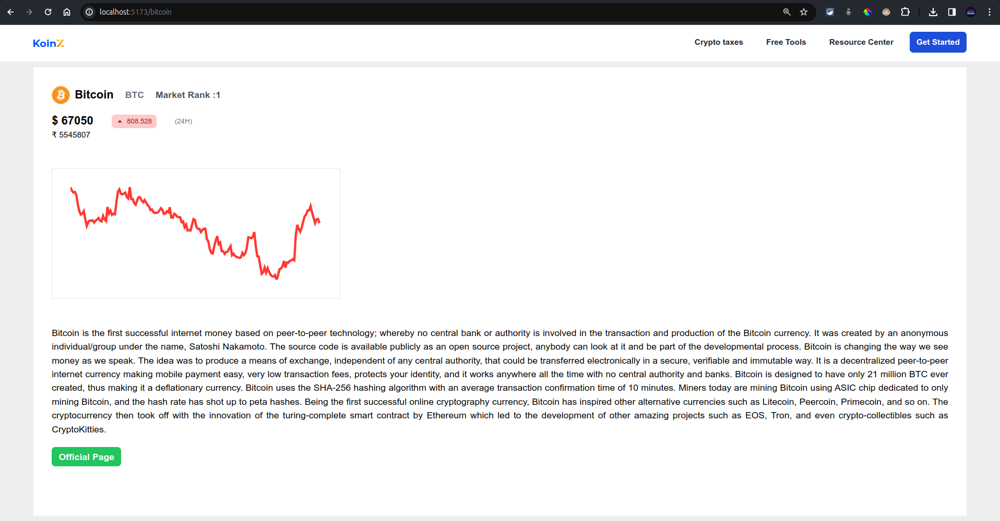

# Koinx Crypto Application 
Koinx Crypto is powered by crypto APIs, KoinX provides seamless access to coin information, market analysis, and intuitive tools for cryptocurrency enthusiasts.Build in React.js framework. 
### Live link: [here](https://durgeshcrypto.vercel.app/)
#### Home Page


#### Individual Coin Info Page



## Installation Guide

### Requirements
- [React js](https://react.dev/)
- [Crypto API](https://www.coingecko.com/api/documentation)
- [Vercel](https://vercel.com/)


```shell
git clone https://github.com/durgeshmehar/koinx-task
cd koinx-task
```

To run the development server:
 ```shell
npm install
npm run dev
```
Done! Now open localhost:3000 in your browser.
